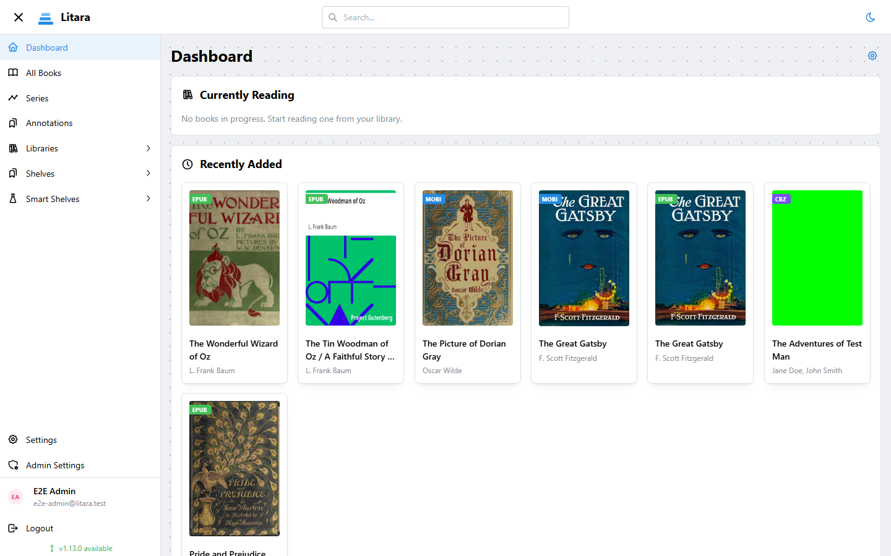
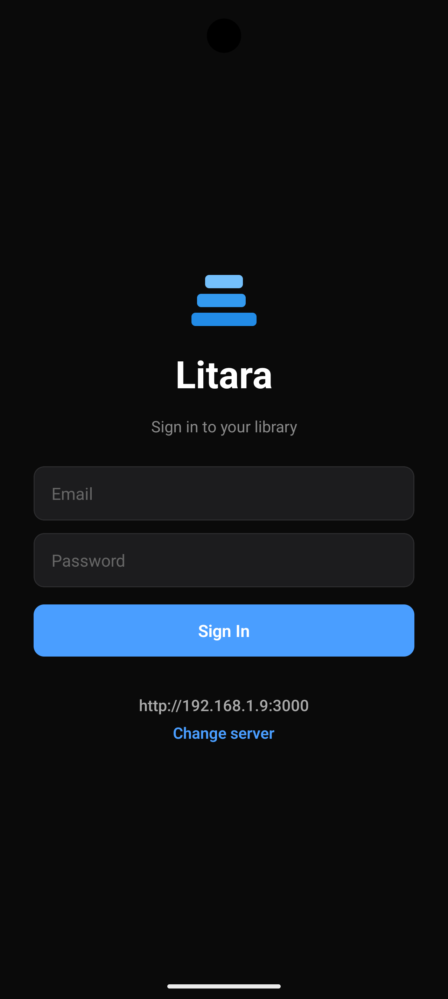
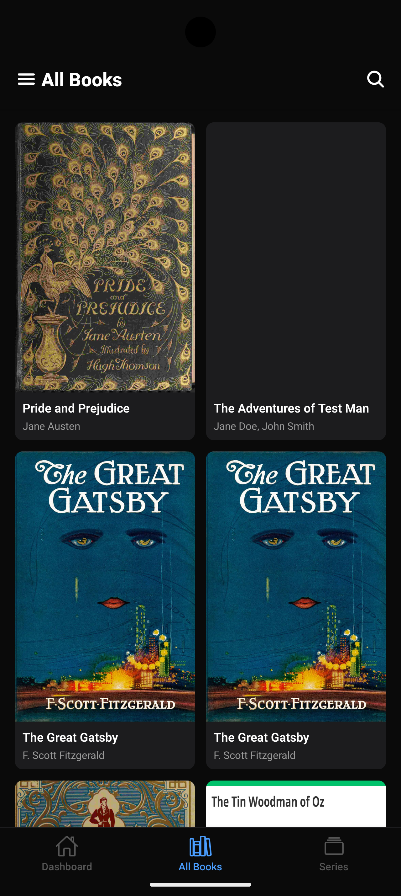
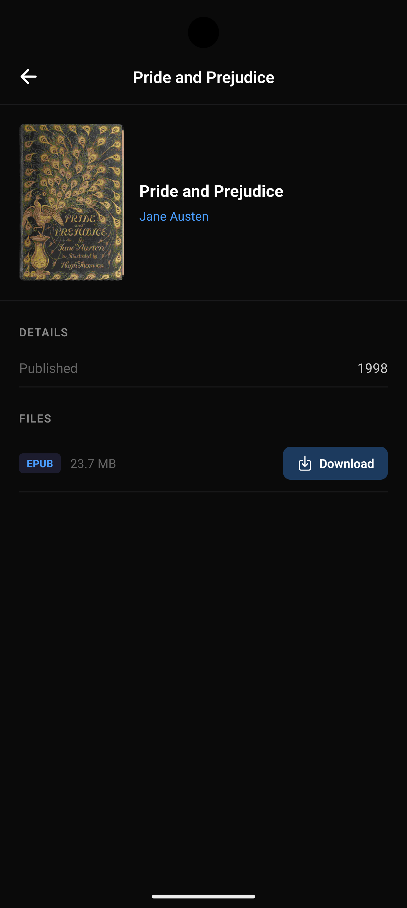

<div align="center">
  

  <h1>Litara</h1>

[](https://litara-app.github.io/litara/)
[](https://github.com/litara-app/litara/releases)
[](https://github.com/litara-app/litara/pkgs/container/litara)
[](https://github.com/litara-app/litara/actions/workflows/release.yml)
[](LICENSE)

</div>

A self-hosted ebook library manager. Automatically scans a folder for ebook files, extracts metadata, and serves a clean web UI for browsing, reading progress, shelves, and annotations.



> **Mobile (Android):** A companion mobile app is in very early alpha. See [mobile docs](https://litara-app.github.io/litara/mobile) for details.

<div align="center">

&nbsp;&nbsp;

&nbsp;&nbsp;

</div>

## Features

- Scans and indexes `.epub`, `.mobi`, `.azw`, `.azw3`, `.fb2` (beta) and `.cbz` files (beta)
- Extracts cover art and metadata (title, authors, series, published date)
- Optional metadata enrichment via Hardcover (API key required, free to obtain), Goodreads, Openlibrary and Google Books (currently "free" tier not working).
- JWT-authenticated multi-user support
- Shelves, smart shelves, reading progress.
- OPDS catalog (v1.2 Atom + v2.0 JSON) for ebook reader apps
- Docker-first deployment

## Quick Start

```bash
cp docker-compose.example.yml docker-compose.yml
docker compose up -d
```

Then open `http://localhost:3000`. On first run, create an account via the login page.

For configuration options, OPDS setup, and local development, see the **[documentation](https://litara-app.github.io/litara/)**.

## Commits

This project uses [Conventional Commits](https://www.conventionalcommits.org/). Releases are automated — pushing to `main` triggers semantic versioning and a GitHub release based on commit types.

| Prefix                                            | Effect                      |
| ------------------------------------------------- | --------------------------- |
| `feat:`                                           | Minor version bump, release |
| `fix:`                                            | Patch version bump, release |
| `BREAKING CHANGE`                                 | Major version bump, release |
| `chore:`, `docs:`, `style:`, `refactor:`, `test:` | No release                  |

## License

MIT
